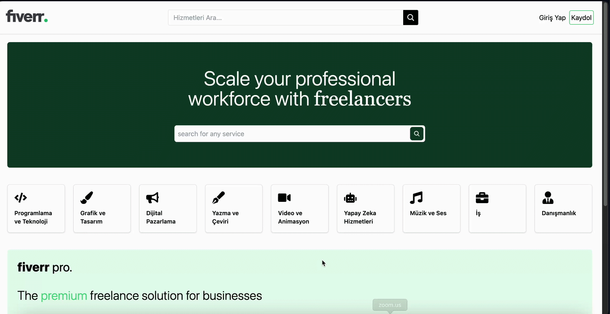

# Fiverr Clone

This project is a full-stack Fiverr Clone application that allows users to create, search, and manage service listings. It includes features like authentication, CRUD operations for services, rating calculations, and review management. The application uses Cloudinary for cloud storage and is built with modern web technologies.

## Features

### Backend
- **User Authentication**: Secure user login and registration using JWT and bcrypt for password hashing.
- **Cloud Storage**: Cloudinary is used for storing images of services.
- **Service Management**: CRUD operations for creating, updating, and deleting service listings.
- **Review System**: Users can submit, delete, and list reviews with rating calculations.
- **Technologies**:
  - **Express** - Server-side framework
  - **Mongoose** - MongoDB object modeling
  - **Nodemon** - Development server
  - **Bcrypt** - Password hashing
  - **Cookie-parser** - Handling cookies
  - **JSON Web Token (JWT)** - Authentication
  - **Dotenv** - Environment variables
  - **Morgan** - HTTP request logger
  - **CORS** - Cross-Origin Resource Sharing

### Frontend
- **Home, Search, Create, and Detail Pages**: User-friendly interface for browsing and managing services.
- **Review Management**: Submit, delete, and list reviews with dynamic rating calculation.
- **Responsive Design**: Fully responsive UI with Tailwind CSS.
- **Technologies**:
  - **React** - Frontend library
  - **React-icons** - Icon library
  - **React-router-dom** - Routing
  - **React-toastify** - Toast notifications
  - **Moment** - Date formatting
  - **React-query** - Data fetching and state management
  - **Axios** - HTTP requests
  - **Tailwind CSS** - Styling framework

# fullstack-Fiverr-Clone
